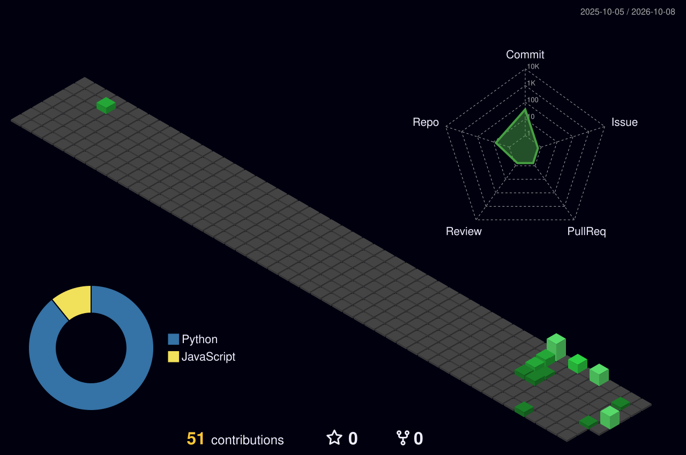

<!-- ███████████████████████████████████████████████████████████████████ -->
<!-- ██  SHIVANSH SINGHAL | @ShivanshSinghaL06 | RETRO TERMINAL README   ██ -->
<!-- ███████████████████████████████████████████████████████████████████ -->


<!-- ░░░░░░░░░░░░░░░░░░░░░░░░░░░░░░░░░░░░░░░░░░░░░░░░░░░░░ -->
<!--                  BIOS POST — BOOT SEQUENCE               -->
<!-- ░░░░░░░░░░░░░░░░░░░░░░░░░░░░░░░░░░░░░░░░░░░░░░░░░░░░░ -->

<div align="center">

```
╔══════════════════════════════════════════════════════════════════╗
║                                                                  ║
║   SHIVANSH SINGHAL  v1.0.26  [BIOS ROM v1.0]                     ║
║   Copyright (C) 1999-2026  Shivansh Singhal. All Rights Res.     ║
║                                                                  ║
╠══════════════════════════════════════════════════════════════════╣
║                                                                  ║
║   CPU ...... Software Engineer @ SGME                            ║
║   RAM ...... 640K OK  (The agents will want more)                ║
║   GPU ...... Retro Shader v42.0 — CRT Phosphor Mode ENABLED      ║
║   DISK ..... /dev/intelligence ............. [MOUNTED]           ║
║   NET ...... github.com/ShivanshSinghaL06 ... [CONNECTED]        ║
║                                                                  ║
║   [✓] POST diagnostics ......................... OK              ║
║   [✓] Loading kernel modules ................... OK              ║
║   [✓] Mounting /dev/intelligence ............... OK              ║
║   [✓] Starting API daemon ...................... OK              ║
║   [✓] Loading LLM guardrails ................... OK              ║
║   [✓] Indexing geospatial layers ............... OK              ║
║   [✓] Compiling full-stack builds .............. OK              ║
║                                                                  ║
║   ░▒▓████████████████████████████████████████▓▒░  100% READY     ║
║                                                                  ║
╚══════════════════════════════════════════════════════════════════╝
```

</div>

<!-- ░░░░░░░░░░░░░░░ DYNAMIC BADGES ░░░░░░░░░░░░░░░░░ -->

<div align="center">


&nbsp;
[](https://github.com/ShivanshSinghaL06)
&nbsp;
[](https://github.com/ShivanshSinghaL06)
&nbsp;

&nbsp;


</div>

<div align="center">

</div>

<!-- ░░░░░░░░░░░░░░░░ SYSTEM INFORMATION ░░░░░░░░░░░░░░░░░ -->

<div align="center">

[](https://git.io/typing-svg)

</div>

<div align="center">

```
╔══════════════════════════════════════════════════════════════════╗
║                     ◄ SYSTEM INFORMATION ►                       ║
╠═══════════════════╦══════════════════════════════════════════════╣
║  USER             ║  Shivansh Singhal                            ║
║  CLASS            ║  Software Engineer                           ║
║  ROLE             ║  Full-Stack · AI · GIS Automation            ║
║  BASE             ║  Brisbane, QLD, Australia                    ║
║  SHELL            ║  Git + Docker + Linux                        ║
║  UPTIME           ║  2+ years shipping                           ║
║  STATUS           ║  ● ONLINE — SGME, Brisbane                   ║
╠═══════════════════╬══════════════════════════════════════════════╣
║  QUEST            ║  Production AI and full-stack systems        ║
║  PHILOSOPHY       ║  "Own the feature end to end,                ║
║                   ║   from requirements through deploy."         ║
╠═══════════════════╬══════════════════════════════════════════════╣
║  STR  ██████████████████████░░  90%  [Backend & APIs]            ║
║  DEX  █████████████████████░░░  88%  [Full-Stack UI]             ║
║  INT  ██████████████████████░░  92%  [AI & LLM Systems]          ║
║  WIS  █████████████████████░░░  86%  [GIS & Automation]          ║
║  CHA  ████████████████████░░░░  84%  [Cloud & DevOps]            ║
╚═══════════════════╩══════════════════════════════════════════════╝
```

</div>

<div align="center">

</div>

<!-- ░░░░░░░░░░░░░░░░░░░ ABOUT ME ░░░░░░░░░░░░░░░░░░░░░ -->

<details open>
<summary><b>
  
</b></summary>
<br>

<div align="center">

|                |                                                                                          |
| -------------- | ---------------------------------------------------------------------------------------- |
| **Who am I**   | Software Engineer with 2+ years shipping production web apps and AI systems             |
| **Focus**      | Full-stack development, backend APIs, cloud, and GIS automation                         |
| **Languages**  | Python, TypeScript, JavaScript, Java, C#, C++, Go, R, SQL                               |
| **Specialty**  | Multi-agent LLM systems · RAG · React / Next.js · FastAPI · QGIS                        |
| **Philosophy** | _Own the feature end to end, from requirements through deployment._                     |
| **Education**  | BCompSc, RMIT · minor in Data Science & Blockchain · Feb 2023 – Dec 2025                |
| **Based**      | Brisbane, QLD                                                                           |

</div>

<br>

```
┌──────────────────────────────────────────────────────────────────────┐
│                                                                      │
│   > Shivansh Singhal, Software Engineer in Brisbane                  │
│   > Production full-stack, AI/LLM, and GIS automation                │
│   > 9-agent document QA on FastAPI, Redis, AWS Bedrock               │
│   > Multi-tenant CRM in React, Next.js, and PostgreSQL               │
│   > QGIS automation, LiDAR pipelines, landform models                │
│   > RMIT Computer Science, Data Science & Blockchain                 │
│                                                                      │
└──────────────────────────────────────────────────────────────────────┘
```

</details>

<div align="center">

</div>

<!-- ░░░░░░░░░░░░░ CURRENTLY WORKING ON ░░░░░░░░░░░░░░░ -->

<div align="center">

[](https://git.io/typing-svg)

</div>

<div align="center">

```
╔═══════════════════════════════════════════════════════╗
║              ◄ ACTIVE PROCESSES ►                     ║
╠═══════════════════════════════════════════════════════╣
║                                                       ║
║  PID   PROCESS            STATUS     CPU              ║
║  ───   ────────────────── ────────── ────             ║
║  001   Doc QA platform    ● RUNNING  94%              ║
║  002   Mining CRM         ● RUNNING  88%              ║
║  003   QGIS / LiDAR       ● RUNNING  82%              ║
║  004   RAG guardrails     ● RUNNING  90%              ║
║  005   CI/CD + tracing    ● RUNNING  76%              ║
║                                                       ║
╚═══════════════════════════════════════════════════════╝
```

</div>

<div align="center">

</div>

<!-- ░░░░░░░░░░░░░░░░ EXPERIENCE ░░░░░░░░░░░░░░░░░░░░░ -->

<div align="center">

[](https://git.io/typing-svg)

</div>

<div align="center">

```
╔══════════════════════════════════════════════════════════════════════╗
║                          ◄ EXPERIENCE LOG ►                          ║
╠══════════════════════════════════════════════════════════════════════╣
║  SGME Pty Ltd · Software Engineer · Brisbane            Jul 2026-Now ║
║    > 9-agent document QA on FastAPI, Redis, and AWS Bedrock          ║
║    > RAG with Titan embeddings and pgvector, plus 4 guardrails       ║
║    > CRM for BHP, Glencore, and Peabody: React, Next.js, Node        ║
║    > QGIS MCP server, LiDAR pipelines, WEPP landform modelling       ║
╠══════════════════════════════════════════════════════════════════════╣
║  Phi Technologies · Software Developer · Melbourne Apr 2025-Apr 2026 ║
║    > Shipped kiosk, web ordering, and admin portal end to end        ║
║    > OpenAI assistant integrated into support, requests down 40%     ║
║    > YOLO classifier for scratches, dents, cracks, screen damage     ║
╠══════════════════════════════════════════════════════════════════════╣
║  Intuitify AI Labs · SWE Intern · Melbourne        Nov 2024-Feb 2025 ║
║    > C# / ASP.NET Core APIs for an AI learning platform              ║
║    > About 30% faster APIs via SQL Server tuning and async work      ║
║    > Angular / TypeScript UI and Azure DevOps CI/CD                  ║
╠══════════════════════════════════════════════════════════════════════╣
║  Cognitive View · Data Analyst Intern · Melbourne  Sep 2024-Nov 2024 ║
║    > Cleaned business data with Python, SQL, and Excel               ║
║    > 5 Power BI dashboards using DAX and Power Query                 ║
╚══════════════════════════════════════════════════════════════════════╝
```

</div>

<div align="center">

</div>

<!-- ░░░░░░░░░░░░░░░░ FEATURED BUILDS ░░░░░░░░░░░░░░░░ -->

<div align="center">

[](https://git.io/typing-svg)

</div>

<div align="center">

```
╔══════════════════════════════════════════════════════════════════════╗
║                         ◄ FEATURED BUILDS ►                          ║
╠══════════════════════════════════════════════════════════════════════╣
║  Semantic Doc Search   Python, FastAPI, Bedrock, pgvector, React     ║
║    > Hybrid BM25 + vector search over PDF and Word, with citations   ║
║  URL Shortener         Go, Node, Redis, PostgreSQL, AWS, Docker      ║
║    > Base62 links, rate limits, click analytics, 10k+ req/s          ║
║  Rate Limiter          Python, Go, Redis, Kubernetes                 ║
║    > Token bucket, sliding window, JWT, Prometheus / Grafana         ║
║  Realtime Chat         Java, Spring Boot, WebSocket, AWS             ║
║    > WebSocket messaging, EC2, ElastiCache, chat-history APIs        ║
╚══════════════════════════════════════════════════════════════════════╝
```

</div>

<div align="center">

</div>

<!-- ░░░░░░░░░░░░░░░░░░ TECH STACK ░░░░░░░░░░░░░░░░░░░░ -->

<div align="center">

[](https://git.io/typing-svg)

</div>

<details open>
<summary><b><code>〔 LANGUAGES 〕</code></b> — <i>click to expand/collapse</i></summary>
<br>
<div align="center">


</div>
</details>

<details open>
<summary><b><code>〔 FRONTEND 〕</code></b> — <i>click to expand/collapse</i></summary>
<br>
<div align="center">


</div>
</details>

<details open>
<summary><b><code>〔 BACKEND 〕</code></b> — <i>click to expand/collapse</i></summary>
<br>
<div align="center">


</div>
</details>

<details open>
<summary><b><code>〔 AI & LLM 〕</code></b> — <i>click to expand/collapse</i></summary>
<br>
<div align="center">


</div>
</details>

<details open>
<summary><b><code>〔 DEVOPS & CLOUD 〕</code></b> — <i>click to expand/collapse</i></summary>
<br>
<div align="center">


</div>
</details>

<details open>
<summary><b><code>〔 DATA & OBSERVABILITY 〕</code></b> — <i>click to expand/collapse</i></summary>
<br>
<div align="center">


</div>
</details>

<details open>
<summary><b><code>〔 GIS & 3D 〕</code></b> — <i>click to expand/collapse</i></summary>
<br>
<div align="center">


</div>
</details>

<details open>
<summary><b><code>〔 CERTIFICATIONS 〕</code></b> — <i>click to expand/collapse</i></summary>
<br>
<div align="center">


</div>
</details>

<div align="center">

</div>

<!-- ░░░░░░░░░░░░░░░░ GITHUB STATS ░░░░░░░░░░░░░░░░░░░ -->

<div align="center">

[](https://git.io/typing-svg)

</div>

<div align="center">


</div>

<br>

<div align="center">


</div>

<div align="center">

</div>

<!-- ░░░░░░░░░░░░░░░ 3D CONTRIBUTION GLOBE ░░░░░░░░░░░░░░░ -->

<details open>
<summary><b>
  
</b> — <i>click to expand/collapse</i></summary>
<br>

<div align="center">

<a href="https://github.com/yoshi389111/github-profile-3d-contrib">
  
</a>

</div>

</details>

<div align="center">

</div>

<!-- ░░░░░░░░░░░░░░░ SNAKE ANIMATION ░░░░░░░░░░░░░░░░░░ -->

<div align="center">

[](https://git.io/typing-svg)

</div>

<div align="center">

<picture>
  <source media="(prefers-color-scheme: dark)" srcset="https://raw.githubusercontent.com/ShivanshSinghaL06/ShivanshSinghaL06/output/github-contribution-grid-snake-dark.svg" />
  <source media="(prefers-color-scheme: light)" srcset="https://raw.githubusercontent.com/ShivanshSinghaL06/ShivanshSinghaL06/output/github-contribution-grid-snake.svg" />
  
</picture>

</div>

<div align="center">

</div>

<!-- ░░░░░░░░░░░░░░░ SOCIAL LINKS ░░░░░░░░░░░░░░░░░░░░ -->

<div align="center">

[](https://git.io/typing-svg)

</div>

<div align="center">

```
  ╔═══════════════════════════════════════════╗
  ║   PORT  SERVICE        STATUS             ║
  ╠═══════════════════════════════════════════╣
  ║   :443  Portfolio      ● CONNECTED        ║
  ║   :443  LinkedIn       ● CONNECTED        ║
  ║   :25   Email          ● CONNECTED        ║
  ║   :61   0410 562 278   ● CONNECTED        ║
  ║   :443  GitHub         ● CONNECTED        ║
  ╚═══════════════════════════════════════════╝
```

</div>

<div align="center">

[](https://shivanshssinghal-vert.vercel.app/)
[](https://linkedin.com/in/shivanshssinghal)
[](mailto:shivanshssinghal@gmail.com)
[](tel:+61410562278)
[](https://github.com/ShivanshSinghaL06)

</div>

<div align="center">

</div>

<!-- ░░░░░░░░░░░░░░░ DEV QUOTE ░░░░░░░░░░░░░░░░░░░░░ -->

<div align="center">

[](https://git.io/typing-svg)

```
  _______________________________________________
 /                                               \
|  "Own the feature end to end,                   |
|   from requirements through deploy."            |
 \_______________________________________________/
        \   ^__^
         \  (oo)\_______
            (__)\       )\/\
                ||----w |
                ||     ||
```

</div>

<div align="center">

[](https://github.com/piyushsuthar/github-readme-quotes)

</div>

<div align="center">

</div>

<!-- ░░░░░░░░░░░░░░░ EASTER EGG ░░░░░░░░░░░░░░░░░░░░ -->

<details>
<summary><b><code>C:\Shivansh&gt; cat /dev/secret</code> 👈 click me if you dare</b></summary>
<br>

<div align="center">

```
┌──────────────────────────────────────────────┐
│                                              │
│   YOU FOUND THE SECRET TERMINAL!             │
│                                              │
│   > You must be a curious developer.         │
│   > That's a great quality.                  │
│   > Here's a cookie.                         │
│                                              │
│   fun facts:                                 │
│   ├── 9-agent document QA at SGME            │
│   ├── YOLO defect classifier at Phi          │
│   ├── QGIS MCP and LiDAR pipelines           │
│   ├── RMIT CS, data science minor            │
│   └── debugs until the build goes green      │
│                                              │
│   > Now close this and star the repo.        │
│                                              │
└──────────────────────────────────────────────┘
```

</div>

</details>

<div align="center">

</div>

<!-- ░░░░░░░░░░░░░░░░░ METRICS ░░░░░░░░░░░░░░░░░░░░░░ -->

<details>
<summary><b><code>$ cat /proc/github_metrics</code></b> — <i>click for deep metrics</i></summary>
<br>

<div align="center">


</div>

</details>

<div align="center">

</div>

<!-- ░░░░░░░░░░░░░░░░░ FOOTER ░░░░░░░░░░░░░░░░░░░░░ -->

<div align="center">

[](https://git.io/typing-svg)

```dos
C:\Shivansh> shutdown /s /t 0 /message "Thanks for visiting!"

╔══════════════════════════════════════════════════════════════════╗
║                                                                  ║
║   > Session terminated.                                          ║
║   > All processes stopped.                                       ║
║   > Memory freed: 640K reclaimed.                                ║
║   > Contributions saved to disk.                                 ║
║                                                                  ║
║   > Thank you for visiting SHIVANSH-OS.                          ║
║   > Until next commit...                                         ║
║                                                                  ║
║                    [ C:\Shivansh> █ ]                            ║
║                                                                  ║
╚══════════════════════════════════════════════════════════════════╝
```

</div>

<div align="center">


</div>

<div align="center">

**If you liked this profile, consider giving it a star.**

  <a href="https://github.com/ShivanshSinghaL06">
    
  </a>

</div>

<!-- Made with care by Shivansh Singhal | @ShivanshSinghaL06 -->
